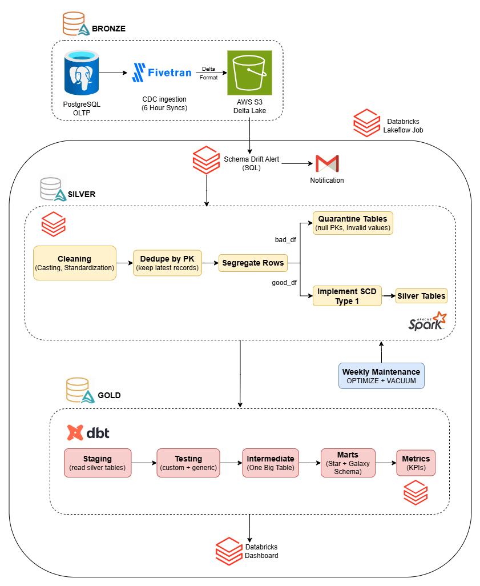
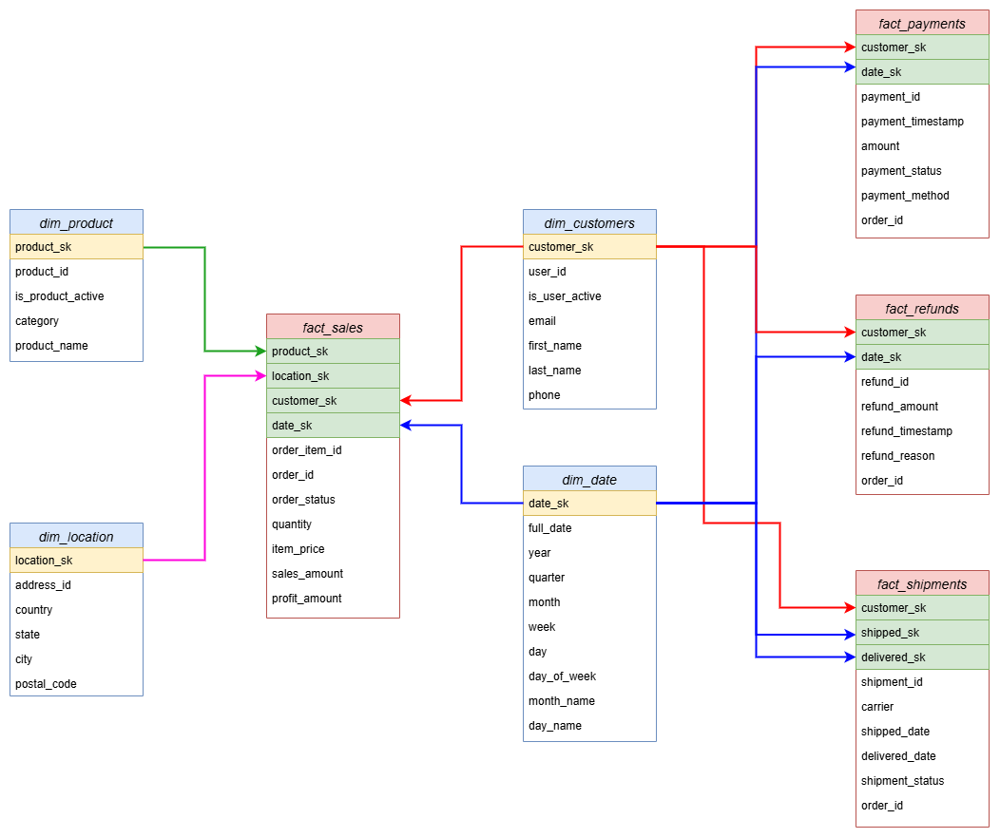
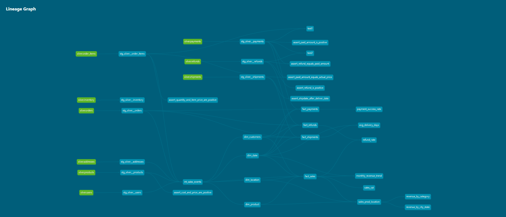
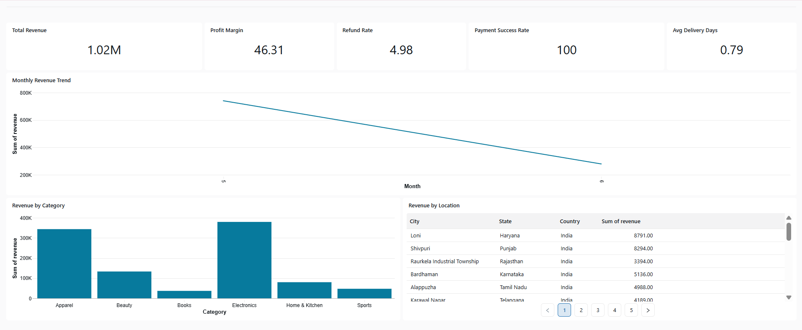
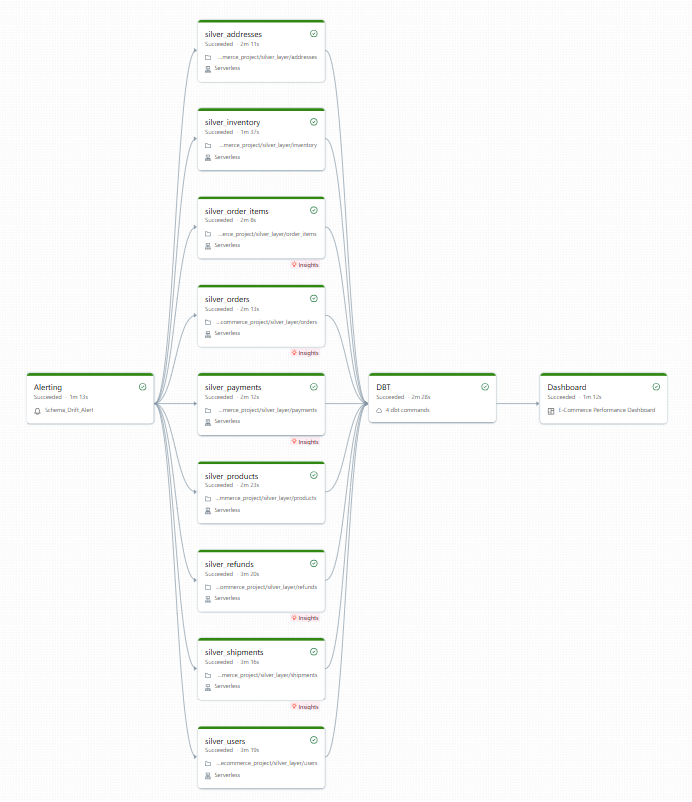

An end-to-end data engineering project built on a **medallion architecture** (Bronze → Silver → Gold), ingesting CDC events from a simulated PostgreSQL OLTP source, transforming them through PySpark and dbt, and surfacing KPIs on a Databricks dashboard.

---

## Architecture



---

## Tech Stack

| Layer | Technology |
|---|---|
| Source | NeonDB (PostgreSQL OLTP) |
| Ingestion | Fivetran CDC |
| Storage | AWS S3 (Delta Lake) |
| Processing | Databricks (PySpark Structured Streaming) |
| Transformation | dbt Core |
| Compute | Databricks SQL Warehouse |
| Catalog | Databricks Unity Catalog |
| Orchestration | Databricks Lakeflow Jobs |
| Dashboard | Databricks Dashboard |

---

## Pipeline Overview

### Bronze Layer — CDC Ingestion

- A simulated ecommerce PostgreSQL OLTP database on **NeonDB** with 9 tables serves as the source
- **Fivetran CDC** captures every insert, update, and delete and lands the data in **AWS S3** as Delta tables
- Fivetran syncs on a **6-hour cadence**, writing to the S3 landing zone

```
NeonDB (PostgreSQL OLTP) → Fivetran CDC → AWS S3 Delta Lake
```

**Tables ingested:** `users`, `orders`, `order_items`, `products`, `inventory`, `addresses`, `payments`, `shipments`, `refunds`

---

### Schema Drift Alert

Before the Silver layer runs, a SQL-based check compares current column counts in the Bronze Delta tables against a baseline stored in `ecom.monitoring.table_baseline`. If any table has new columns, an **email alert fires immediately**.

```sql
SELECT
  c.table_name,
  c.current_column_count,
  b.expected_column_count,
  (c.current_column_count - b.expected_column_count) AS new_columns_detected
FROM current_s3_metadata c
JOIN ecom.monitoring.table_baseline b
  ON c.table_name = b.table_name
WHERE c.current_column_count > b.expected_column_count;
```

---

### Silver Layer — PySpark Processing

Built on **Databricks** using **PySpark Structured Streaming** (`readStream`, `trigger=availableNow`). There are **9 notebooks running in parallel**, one per Bronze Delta table. Each notebook follows the same 6-step pipeline:

| Step | Description |
|---|---|
| Read | Stream Bronze Delta table from S3 external location |
| Clean & Cast | Type casting, string trimming, add `_silver_processed_at` timestamp |
| Dedupe by PK | Window function on PK ordered by `_fivetran_synced DESC`, keep latest record |
| Segregate | Split into `good_df` (valid PK, valid values) and `bad_df` (null PK, impossible values) |
| Quarantine | `bad_df` appended to `ecom.silver.<table>_quarantine` with `mergeSchema=True` |
| SCD Type 1 | `good_df` upserted into `ecom.silver.<table>` via Delta `merge()` on PK |

**Unity Catalog layout:**
```
ecom.silver.<table>             → 9 clean, deduplicated tables
ecom.silver.<table>_quarantine  → 9 quarantine tables (bad rows, preserved and traceable)
```

Checkpoints are stored in `/Volumes/ecom/silver/checkpoints/` ensuring **exactly-once processing** — no data loss or reprocessing on restart.

---

### Gold Layer — dbt Transformation

Built with **dbt Core** using **Databricks SQL Warehouse** as compute. All models materialize into `ecom.gold`.

```
Staging → Testing → Intermediate → Marts → Metrics
```

**Staging (9 models)**
One model per Silver table, performing a clean 1:1 read. **40+ dbt tests** (generic + custom) enforcing not-null constraints, referential integrity, and accepted value ranges run at this layer.

**Intermediate (1 model)**
`int_sales_events` — a single denormalized table joining `order_items → orders → products → users → addresses` via CTEs, serving as the foundation for the star schema.

**Marts — Star + Galaxy Schema**



| Model | Schema type | Description |
|---|---|---|
| `fact_sales` | Star | Core sales fact — joins all 4 dimensions |
| `fact_payments` | Galaxy | Payment events sharing `dim_customers` + `dim_date` |
| `fact_refunds` | Galaxy | Refund events sharing `dim_customers` + `dim_date` |
| `fact_shipments` | Galaxy | Shipment events — joins `dim_date` twice (shipped + delivered) |
| `dim_customers` | Dimension | Customer attributes |
| `dim_product` | Dimension | Product attributes |
| `dim_location` | Dimension | Address/location attributes |
| `dim_date` | Dimension | Full date spine with year, quarter, month, week, day |

**Metrics (7 models, materialized as tables in `ecom.gold`)**

| Model | KPI |
|---|---|
| `sales_rp` | Total revenue, profit margin % |
| `monthly_revenue_trends` | Revenue over time |
| `revenue_by_category` | Revenue breakdown by product category |
| `revenue_by_city` | Revenue breakdown by city |
| `payment_success_rate` | % of successful payments |
| `refund_rate` | Refund rate over time |
| `avg_delivery_days` | Average days from shipment to delivery |

**dbt Lineage Graph**



---

### Dashboard Layer

All 7 metric tables are visualized on a **Databricks Dashboard**, refreshed automatically at the end of every pipeline run.



**Live KPIs:**
- Total Revenue: **$1.02M**
- Profit Margin: **46.31%**
- Refund Rate: **4.98%**
- Payment Success Rate: **100%**
- Avg Delivery Days: **0.79**

Additional charts: Monthly Revenue Trend, Revenue by Category, Revenue by Location.

---

### Maintenance Layer

A weekly Databricks notebook runs `OPTIMIZE` and `VACUUM` across all 9 Silver tables, ensuring Delta file compaction, small-file problem mitigation, and storage reclamation as the pipeline scales.

```python
for table in SILVER_TABLES:
    spark.sql(f"OPTIMIZE {table}")
    spark.sql(f"VACUUM {table} RETAIN {RETENTION_HOURS} HOURS")
```

---

## Orchestration

**Databricks Lakeflow Jobs** orchestrates everything from the Schema Drift Alert through to the Dashboard refresh. The Bronze layer is orchestrated entirely by Fivetran.

**Trigger:** File update detection on S3 — the DAG fires when all 9 Bronze Delta tables have been updated by Fivetran.

**DAG:**
```
Schema Drift Alert
       ↓
9 Silver Notebooks (parallel)
       ↓
dbt deps
dbt run -s staging
dbt test
dbt run -s intermediate marts.dimensions marts.sales marts.refunds marts.shipments marts.payments marts.metrics
       ↓
Databricks Dashboard refresh
```



Email notifications fire on pipeline **start**, **success**, and **failure** — zero silent failures.

---

## Data Quality

| Metric | Value |
|---|---|
| dbt tests | 40+ (generic + custom) |
| Tables monitored | 9 |
| Quarantine tables | 9 (one per entity, bad rows preserved and traceable) |
| Schema drift detection | Automated, pre-Silver, email alert |
| Pipeline success rate | 100% |
| Dashboard KPIs | 8 |

---

## Key Engineering Decisions

**Idempotent upserts** — SCD Type 1 Delta `merge()` on PK means the pipeline can be re-run at any point without duplicating data.

**Exactly-once processing** — checkpoint-based streaming ensures no data is lost or reprocessed on restart.

**Dual-path data segregation** — bad rows are never dropped; they are routed to quarantine tables with a `_rejection_reason` and `_rejected_at` timestamp, keeping them traceable for debugging.

**Conformed dimensions** — `dim_customers` and `dim_date` are shared across all 4 fact tables, enabling consistent cross-domain analysis without metric discrepancies.

**Pre-aggregated metrics** — the dashboard queries pre-computed `ecom.gold` metric tables rather than raw fact tables, keeping SQL Warehouse compute cost low and dashboard load times fast.

**Schema drift gating** — the alert runs before any Silver notebook, so a breaking upstream schema change is caught before it can corrupt downstream models.

---
